<h1 style='font-size:20px;text-align: center'>
How to restore Aqua MODIS band 06 missing pixels 
using a nonlinear regression based on Gaussian processes ?: 
An application based on python and Scikit-Learn.
</h1>

<p style='text-align: center'>
Author: Benjamin Marchant 
<br>(marchant.benjamin01@gmail.com)
<br>(benjamin.marchant@nasa.gov)
<br> v1.0.0
</p>


```python
import matplotlib.pyplot as plt
import matplotlib as mpl
import matplotlib.cm as cm
import numpy as np
import warnings

from matplotlib.pyplot import figure
from IPython.core.display import HTML
from pyhdf.SD import SD, SDC 

warnings.filterwarnings('ignore')
```


```python
from IPython.core.display import HTML
HTML("""
<style>
.output_png {
    display: table-cell;
    text-align: center;
    vertical-align: middle;
}
</style>
""")
```


<style>
.output_png {
    display: table-cell;
    text-align: center;
    vertical-align: middle;
}
</style>


```python
myd021km_file = SD('MYD021KM.A2007219.2010.006.2012077031102.hdf', SDC.READ)
```


```python
EV_250_Aggr1km_RefSB = myd021km_file.select('EV_250_Aggr1km_RefSB')
EV_500_Aggr1km_RefSB = myd021km_file.select('EV_500_Aggr1km_RefSB')
EV_1KM_RefSB = myd021km_file.select('EV_1KM_RefSB')
EV_1KM_Emissive = myd021km_file.select('EV_1KM_Emissive')
```


```python
modis_band_dic = {}
```


```python
#print( EV_250_Aggr1km_RefSB.info() )
EV_250_Aggr1km_RefSB_attributes = EV_250_Aggr1km_RefSB.attributes()
EV_250_Aggr1km_RefSB_scales = EV_250_Aggr1km_RefSB_attributes['reflectance_scales']
EV_250_Aggr1km_RefSB_offsets = EV_250_Aggr1km_RefSB_attributes['reflectance_offsets']
#pprint.pprint(EV_250_Aggr1km_RefSB_attributes )

for idx,i in enumerate(EV_250_Aggr1km_RefSB_attributes['band_names'].split(',')):
    print(idx,i)    
    modis_band_dic[i] = [EV_250_Aggr1km_RefSB,idx]
```

    0 1
    1 2


```python
#print( EV_500_Aggr1km_RefSB.info() )
EV_500_Aggr1km_RefSB_attributes = EV_500_Aggr1km_RefSB.attributes()
EV_500_Aggr1km_RefSB_scales = EV_500_Aggr1km_RefSB_attributes['reflectance_scales']
EV_500_Aggr1km_RefSB_offsets = EV_500_Aggr1km_RefSB_attributes['reflectance_offsets']
#pprint.pprint(EV_500_Aggr1km_RefSB_attributes )

for idx,i in enumerate(EV_500_Aggr1km_RefSB_attributes['band_names'].split(',')):
    print(idx,i)
    modis_band_dic[i] = [EV_500_Aggr1km_RefSB,idx]
```

    0 3
    1 4
    2 5
    3 6
    4 7


```python
#print( EV_1KM_RefSB.info() )
EV_1KM_RefSB_attributes = EV_1KM_RefSB.attributes()
EV_1KM_RefSB_scales = EV_1KM_RefSB_attributes['reflectance_scales']
EV_1KM_RefSB_offsets = EV_1KM_RefSB_attributes['reflectance_offsets']
#pprint.pprint(EV_1KM_RefSB_attributes )

for idx,i in enumerate(EV_1KM_RefSB_attributes['band_names'].split(',')):
    print(idx,i)
    modis_band_dic[i] = [EV_1KM_RefSB,idx]
```

    0 8
    1 9
    2 10
    3 11
    4 12
    5 13lo
    6 13hi
    7 14lo
    8 14hi
    9 15
    10 16
    11 17
    12 18
    13 19
    14 26


```python
print( EV_1KM_Emissive.info() )
EV_1KM_Emissive_attributes = EV_1KM_Emissive.attributes()
EV_1KM_Emissive_scales = EV_1KM_Emissive_attributes['radiance_scales']
EV_1KM_Emissive_offsets = EV_1KM_Emissive_attributes['radiance_offsets']
#pprint.pprint(EV_1KM_Emissive_attributes )

for idx,i in enumerate(EV_1KM_Emissive_attributes['band_names'].split(',')):
    print(idx,i)
    modis_band_dic[i] = [EV_1KM_Emissive,idx]
```

    ('EV_1KM_Emissive', 3, [16, 2030, 1354], 23, 8)
    0 20
    1 21
    2 22
    3 23
    4 24
    5 25
    6 27
    7 28
    8 29
    9 30
    10 31
    11 32
    12 33
    13 34
    14 35
    15 36


```python
for key in modis_band_dic:
    print(key, modis_band_dic[key][0].info()[0], modis_band_dic[key][1])
```

    1 EV_250_Aggr1km_RefSB 0
    2 EV_250_Aggr1km_RefSB 1
    3 EV_500_Aggr1km_RefSB 0
    4 EV_500_Aggr1km_RefSB 1
    5 EV_500_Aggr1km_RefSB 2
    6 EV_500_Aggr1km_RefSB 3
    7 EV_500_Aggr1km_RefSB 4
    8 EV_1KM_RefSB 0
    9 EV_1KM_RefSB 1
    10 EV_1KM_RefSB 2
    11 EV_1KM_RefSB 3
    12 EV_1KM_RefSB 4
    13lo EV_1KM_RefSB 5
    13hi EV_1KM_RefSB 6
    14lo EV_1KM_RefSB 7
    14hi EV_1KM_RefSB 8
    15 EV_1KM_RefSB 9
    16 EV_1KM_RefSB 10
    17 EV_1KM_RefSB 11
    18 EV_1KM_RefSB 12
    19 EV_1KM_RefSB 13
    26 EV_1KM_RefSB 14
    20 EV_1KM_Emissive 0
    21 EV_1KM_Emissive 1
    22 EV_1KM_Emissive 2
    23 EV_1KM_Emissive 3
    24 EV_1KM_Emissive 4
    25 EV_1KM_Emissive 5
    27 EV_1KM_Emissive 6
    28 EV_1KM_Emissive 7
    29 EV_1KM_Emissive 8
    30 EV_1KM_Emissive 9
    31 EV_1KM_Emissive 10
    32 EV_1KM_Emissive 11
    33 EV_1KM_Emissive 12
    34 EV_1KM_Emissive 13
    35 EV_1KM_Emissive 14
    36 EV_1KM_Emissive 15


```python
def plot_MODIS_L1(MODIS_band, modis_band_dic):

    data_selected_id = modis_band_dic[str(MODIS_band)][0]
    band_idx = modis_band_dic[str(MODIS_band)][1]
    title = 'MODIS Band' + str(MODIS_band)
    
    figure(num=None, figsize=(12, 10), dpi=80, facecolor='w', edgecolor='k')

    data = EV_500_Aggr1km_RefSB.get()
    data_selected_band = data[band_idx,:,:]
    data_selected_attributes = data_selected_id.attributes()
    _FillValue = data_selected_attributes['_FillValue']
    _FillValue = 65528 # warning wrong _FillValue stored in attributes    

    if modis_band_dic[str(MODIS_band)][0].info()[0] == 'EV_1KM_Emissive':
    
        radiance_scales = data_selected_attributes['radiance_scales']
        radiance_offsets = data_selected_attributes['radiance_offsets']
        data_selected_band[ data_selected_band == _FillValue ] = 0.0
        data_selected_band = (data_selected_band - radiance_offsets[band_idx]) * radiance_scales[band_idx]    
    
    else:
    
        reflectance_scales = data_selected_attributes['reflectance_scales']
        data_selected_band[ data_selected_band == _FillValue ] = 0.0
        data_selected_band = data_selected_band * reflectance_scales[band_idx]

    cmap = [(0.0,0.0,0.0)] + [(cm.jet(i)) for i in range(1,256)] 
    cmap = mpl.colors.ListedColormap(cmap)
    img = plt.imshow(np.fliplr(data_selected_band), cmap=cmap,interpolation='none', origin='lower')
    plt.title(title, fontsize=11)
    cbar = plt.colorbar()
    cbar.ax.tick_params(labelsize=8)
    l = [int(i) for i in np.linspace(0,data_selected_band.shape[1],6)]
    plt.xticks(l, [i for i in reversed(l)], rotation=0, fontsize=11 )
    l = [int(i) for i in np.linspace(0,data_selected_band.shape[0],9)]
    plt.yticks(l, l, rotation=0, fontsize=11 )
    plt.xticks(fontsize=11)
    plt.yticks(fontsize=11)    
    plt.show()
```


```python
plot_MODIS_L1(6,modis_band_dic)
```


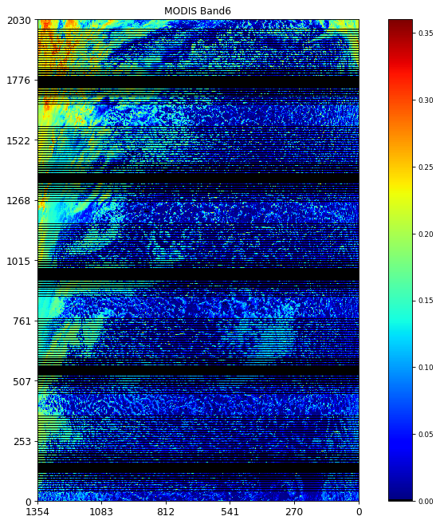


```python
plot_MODIS_L1(7,modis_band_dic)
```


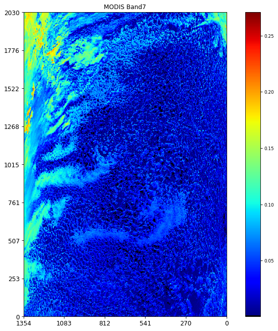


```python
MODIS_band = 6
    
data_selected_id = modis_band_dic[str(MODIS_band)][0]
band_idx = modis_band_dic[str(MODIS_band)][1]

data = EV_500_Aggr1km_RefSB.get()
data_band_06 = data[band_idx,:,:]
data_selected_attributes = data_selected_id.attributes()
_FillValue = data_selected_attributes['_FillValue']
_FillValue = 65528 # warning wrong _FillValue stored in attributes  

reflectance_scales = data_selected_attributes['reflectance_scales']
data_band_06[ data_band_06 == _FillValue ] = 0.0
data_band_06 = data_band_06 * reflectance_scales[band_idx]

data_band_6_vmin = np.min(data_band_06)
data_band_6_vmax = np.max(data_band_06)

data_shape = data_band_06.shape

#print(np.where(data_band_06[:,0]==0.0))

#print(np.where(data_band_06[:,0]==0.0)[0].shape)

nb_missing_rows = np.where(data_band_06[:,0]==0.0)[0].shape[0]

band_06_missing_data_idx = np.where(data_band_06==0.0)

print('data_shape --> ', data_shape)

print('nb_missing_rows --> ', nb_missing_rows)

print('number of missing data --> ', nb_missing_rows * data_shape[1])

print('Fraction of missing data --> ', 100.0 * nb_missing_rows * data_shape[1] / ( data_shape[0] * data_shape[1] ))

#for i in range(100):
#    print(i,data_band_6[i,0])

nbx = 25

x = np.arange(nbx)

figure(num=None, figsize=(8, 6), dpi=80, facecolor='w', edgecolor='k')

plt.scatter(x,data_band_06[0:nbx,0])

plt.xlabel('MODIS AlongTrack First 25 Index')

plt.xlim(0,nbx)

plt.show()

plt.close()
```

    data_shape -->  (2030, 1354)
    nb_missing_rows -->  812
    number of missing data -->  1099448
    Fraction of missing data -->  40.0


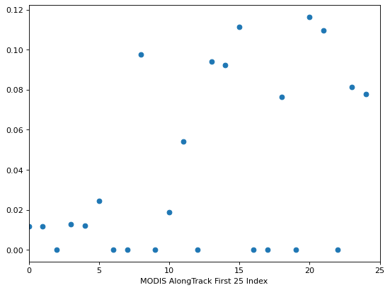


```python
MODIS_band = 7
    
data_selected_id = modis_band_dic[str(MODIS_band)][0]
band_idx = modis_band_dic[str(MODIS_band)][1]

data = EV_500_Aggr1km_RefSB.get()
data_band_07 = data[band_idx,:,:]
data_selected_attributes = data_selected_id.attributes()
_FillValue = data_selected_attributes['_FillValue']
_FillValue = 65528 # warning wrong _FillValue stored in attributes  

reflectance_scales = data_selected_attributes['reflectance_scales']
data_band_07[ data_band_07 == _FillValue ] = 0.0
data_band_07 = data_band_07 * reflectance_scales[band_idx]

a_idx = np.where(data_band_06[:,0]!=0.0)[0]

A = data_band_06[a_idx].ravel()
B = data_band_07[a_idx].ravel()

figure(num=None, figsize=(8, 6), dpi=80, facecolor='w', edgecolor='k')

plt.scatter(A[0:1000],B[0:1000])

plt.xlabel('MODIS Band 06')
plt.ylabel('MODIS Band 07')

plt.show()

plt.close()
```


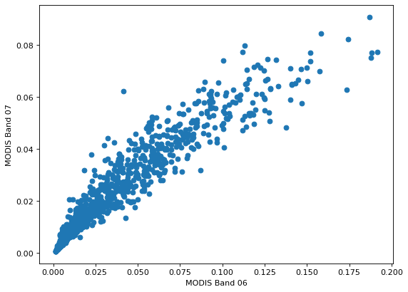


```python
i_start = 0
j_start = 0 

cmap = [(0.0,0.0,0.0)] + [(cm.jet(i)) for i in range(1,256)] 
cmap = mpl.colors.ListedColormap(cmap)

figure(num=None, figsize=(8, 6), dpi=80, facecolor='w', edgecolor='k')

#img = plt.imshow(np.fliplr(data_band_6[0:12,0:12]), cmap=cmap, 
#                 interpolation='none', origin='lower')

img = plt.imshow(data_band_06[i_start:i_start+12,j_start:j_start+12], cmap=cmap, 
                 interpolation='none', origin='lower')

cbar = plt.colorbar()
cbar.ax.tick_params(labelsize=8)

plt.title('Band 06', fontsize=10)

plt.show()
```


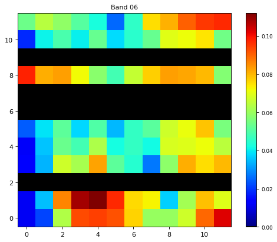


```python
figure(num=None, figsize=(8, 6), dpi=80, facecolor='w', edgecolor='k')

cmap = [(cm.jet(i)) for i in range(1,256)] 
cmap = mpl.colors.ListedColormap(cmap)

img = plt.imshow(data_band_07[i_start:i_start+12,j_start:j_start+12], cmap=cmap, 
                 interpolation='none', origin='lower')

plt.title('Band 07', fontsize=10)

cbar = plt.colorbar()
cbar.ax.tick_params(labelsize=8)

plt.show()

plt.close()
```


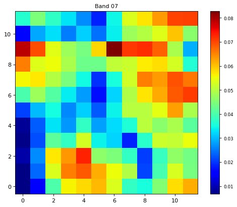


```python
#data_sample = data_band_6[0:12,0:12]

data_sample = np.copy(data_band_06[i_start:i_start+12,j_start:j_start+12])

X = np.stack((np.where(data_sample!=0.0)[0],np.where(data_sample!=0.0)[1]), axis=-1)

Y = data_sample[np.where(data_sample!=0.0)[0],np.where(data_sample!=0.0)[1]]

y_min = np.min(Y)
y_max = np.max(Y)

x1_min = np.min(X[:,0]) # Data Scaling
x1_max = np.max(X[:,0]) # Data Scaling

X = X.astype('float64')

X[:,0] = (1.0*X[:,0]-x1_min) / (x1_max-x1_min)

x2_min = np.min(X[:,1])
x2_max = np.max(X[:,1])

X[:,1] = (1.0*X[:,1]-x2_min) / (x2_max-x2_min)

X_dim1 = X.shape[0]

sigma_n = 0.00

#X = X[:,:,np.newaxis]

#X1 = X[:,0,:]
#X2 = X[:,1,:]


X1 = X[:,0]
X2 = X[:,1]

print(X.shape)
print(Y.shape)
print(X1.shape)
```

    (96, 2)
    (96,)
    (96,)


```python
from sklearn.metrics import accuracy_score, log_loss
from sklearn.gaussian_process import GaussianProcessRegressor
from sklearn.gaussian_process.kernels import RBF
from sklearn.gaussian_process.kernels import DotProduct, ConstantKernel as C
from sklearn import preprocessing


```


```python
%%time

kernel = C(1.0, (0.1, 10.0)) * RBF([0.2,0.2], (1e-2, 1e2))

gp = GaussianProcessRegressor(kernel=kernel, n_restarts_optimizer=20)

model = gp.fit(X,Y)
```

    CPU times: user 2.42 s, sys: 22.4 ms, total: 2.44 s
    Wall time: 1.25 s


```python
%%time

l1 = 0.2
l2 = 0.2
sigma_f = 0.01

kernel = C( 0.01, ( 0.01,  0.01)) * RBF([0.2,0.2], (0.2, 0.2))

gp = GaussianProcessRegressor(kernel=kernel, n_restarts_optimizer=20)

model = gp.fit(X,Y)
```

    CPU times: user 78.7 ms, sys: 1.56 ms, total: 80.3 ms
    Wall time: 41.7 ms


```python
- [AttributeError while adding colorbar in matplotlib](https://stackoverflow.com/questions/2643953/attributeerror-while-adding-colorbar-in-matplotlib/51622063)
- [matplotlib and subplots properties](https://stackoverflow.com/questions/38662667/matplotlib-and-subplots-properties)
```


```python
%%time

X1_new, X2_new = np.meshgrid(np.arange(0, 12, 1.0), np.arange(0, 12, 1.0))

X1_new= (1.0*X1_new-x1_min) / (x1_max-x1_min) # data scaling
X2_new= (1.0*X2_new-x2_min) / (x2_max-x2_min) # data scaling

print(X1_new.shape)

X_new = np.stack((X1_new.ravel(),X2_new.ravel()), axis=-1)

print(X_new.shape)

Y_new = model.predict(X_new)

fig, axs = plt.subplots(1,2,gridspec_kw={'hspace': 0.3},figsize=(14,14))

(ax1, ax2) = axs

img = ax1.imshow(data_sample, cmap=cmap, 
                 interpolation='none', origin='lower')

ax1.set_xlabel(r'$x_1$')
ax1.set_ylabel(r'$x_2$')

ax1.set_title('MODIS Band 06', fontsize=10)

plt.colorbar(img, ax=ax1, shrink=0.35)

img = ax2.imshow(Y_new.reshape(12,12).T, interpolation='nearest', 
           origin='lower', cmap=cm.jet, vmin=0.0, vmax=y_max)

ax2.set_xlabel(r'$x_1$')
ax2.set_ylabel(r'$x_2$')

ax2.set_title('MODIS Band 06 (Restored)', fontsize=10)

plt.colorbar(img, ax=ax2, shrink=0.35)

plt.title('MODIS Band 06 (Restored)', fontsize=10)

plt.show()
```

    (12, 12)
    (144, 2)


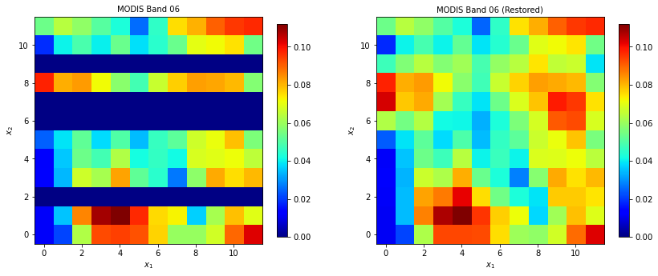


    CPU times: user 522 ms, sys: 8.78 ms, total: 531 ms
    Wall time: 373 ms


```python
X1_new, X2_new = np.meshgrid(np.arange(0, 11, 0.5), np.arange(0, 11, 0.5))


X1_new= (1.0*X1_new-x1_min) / (x1_max-x1_min) # data scaling
X2_new= (1.0*X2_new-x2_min) / (x2_max-x2_min) # data scaling

print(X1_new.shape)

X_new = np.stack((X1_new.ravel(),X2_new.ravel()), axis=-1)

print(X_new.shape)

Y_new = model.predict(X_new)

fig, axs = plt.subplots(1,2,gridspec_kw={'hspace': 0.3},figsize=(14,14))

(ax1, ax2) = axs

img = ax1.imshow(data_sample, cmap=cmap, 
                 interpolation='none', origin='lower')

ax1.set_xlabel(r'$x_1$')
ax1.set_ylabel(r'$x_2$')

ax1.set_title('MODIS Band 06', fontsize=10)

plt.colorbar(img, ax=ax1, shrink=0.35)

img = ax2.imshow(Y_new.reshape(22,22).T, interpolation='nearest', 
           origin='lower', cmap=cm.jet, vmin=0.0, vmax=y_max)

ax2.set_xlabel(r'$x_1$')
ax2.set_ylabel(r'$x_2$')

ax2.set_title('MODIS Band 06 (Restored)', fontsize=10)

plt.colorbar(img, ax=ax2, shrink=0.35)

plt.title('MODIS Band 06 (Restored)', fontsize=10)

plt.show()
```

    (22, 22)
    (484, 2)


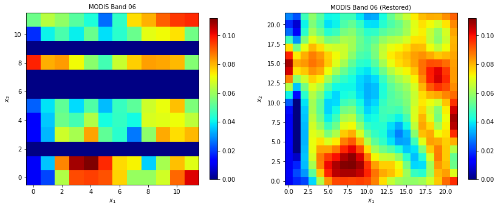


```python
X1_new, X2_new = np.meshgrid(np.arange(0, 10, 0.25), np.arange(0, 10, 0.25))

X1_new= (1.0*X1_new-x1_min) / (x1_max-x1_min) # data scaling
X2_new= (1.0*X2_new-x2_min) / (x2_max-x2_min) # data scaling

print(X1_new.shape)

X_new = np.stack((X1_new.ravel(),X2_new.ravel()), axis=-1)

print(X_new.shape)

Y_new = model.predict(X_new)

fig, axs = plt.subplots(1,2,gridspec_kw={'hspace': 0.3},figsize=(14,14))

(ax1, ax2) = axs

img = ax1.imshow(data_sample, cmap=cmap, 
                 interpolation='none', origin='lower')

ax1.set_xlabel(r'$x_1$')
ax1.set_ylabel(r'$x_2$')

ax1.set_title('MODIS Band 06', fontsize=10)

plt.colorbar(img, ax=ax1, shrink=0.35)

img = ax2.imshow(Y_new.reshape(40,40).T, interpolation='nearest', 
           origin='lower', cmap=cm.jet, vmin=0.0, vmax=y_max)

ax2.set_xlabel(r'$x_1$')
ax2.set_ylabel(r'$x_2$')

ax2.set_title('MODIS Band 06 (Restored)', fontsize=10)

plt.colorbar(img, ax=ax2, shrink=0.35)

plt.title('MODIS Band 06 (Restored)', fontsize=10)

plt.show()
```

    (40, 40)
    (1600, 2)


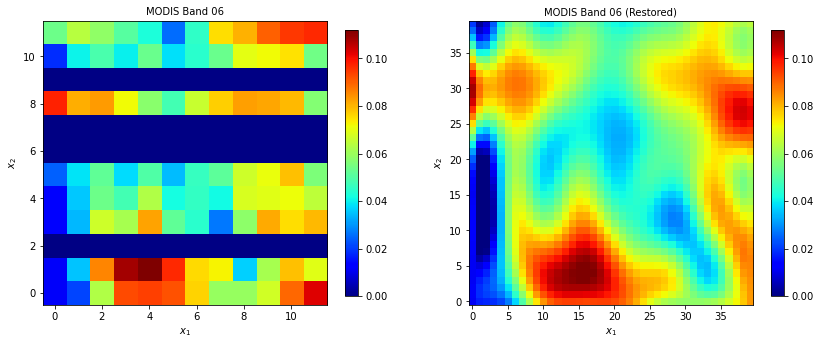


```python
%%time

#X_new = np.stack((np.where(data_sample==0.0)[0],np.where(data_sample==0.0)[1]), axis=-1)

X1_new_unscaled = np.where(data_sample==0.0)[0]
X2_new_unscaled = np.where(data_sample==0.0)[1]

X1_new = (1.0*X1_new_unscaled-x1_min) / (x1_max-x1_min) # data scaling
X2_new = (1.0*X2_new_unscaled-x2_min) / (x2_max-x2_min) # data scaling

X1_new_dim = X1_new.shape

X_new = np.stack((X1_new.ravel(),X2_new.ravel()), axis=-1)

print(X_new.shape)

Y_new = model.predict(X_new)

print(Y_new.shape)

data_band_06[X1_new_unscaled+i_start,X2_new_unscaled+j_start] = Y_new

fig, axs = plt.subplots(1,2,gridspec_kw={'hspace': 0.3},figsize=(14,14))

(ax1, ax2) = axs

img = ax1.imshow(data_sample, cmap=cmap, 
                 interpolation='none', origin='lower')

ax1.set_xlabel(r'$x_1$')
ax1.set_ylabel(r'$x_2$')

ax1.set_title('MODIS Band 06', fontsize=10)

plt.colorbar(img, ax=ax1, shrink=0.35)

img = ax2.imshow(data_band_06[i_start:i_start+12,j_start:j_start+12], cmap=cmap, 
                 interpolation='none', origin='lower',vmin=0.0)

ax2.set_xlabel(r'$x_1$')
ax2.set_ylabel(r'$x_2$')

ax2.set_title('MODIS Band 06 (Restored)', fontsize=10)

plt.colorbar(img, ax=ax2, shrink=0.35)

plt.title('MODIS Band 06 (Restored)', fontsize=10)

plt.show()
```

    (48, 2)
    (48,)


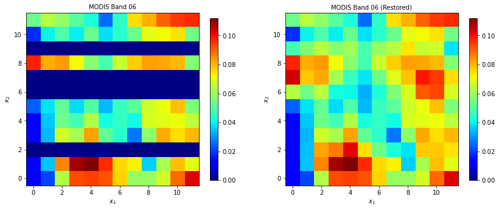


    CPU times: user 322 ms, sys: 6.04 ms, total: 328 ms
    Wall time: 332 ms


```python
%%time

MODIS_band = 6
    
data_selected_id = modis_band_dic[str(MODIS_band)][0]
band_idx = modis_band_dic[str(MODIS_band)][1]

data = EV_500_Aggr1km_RefSB.get()
data_band_06 = data[band_idx,:,:]
data_selected_attributes = data_selected_id.attributes()
_FillValue = data_selected_attributes['_FillValue']
_FillValue = 65528 # warning wrong _FillValue stored in attributes  

reflectance_scales = data_selected_attributes['reflectance_scales']
data_band_06[ data_band_06 == _FillValue ] = 0.0
data_band_06 = data_band_06 * reflectance_scales[band_idx]

data_shape = data_band_06.shape

i_start = 0
j_start = 0

for i_start in np.arange(0,data_shape[0],10):

    if i_start > data_shape[0] - 10: i_start = data_shape[0] - 10
    
    print(i_start)
    
    for j_start in np.arange(0,data_shape[1],12):
        
        if j_start > data_shape[1] - 12: j_start = data_shape[1] - 12

        #print(i_start,j_start)

        data_sample = data_band_06[i_start:i_start+12,j_start:j_start+12]

        X = np.stack((np.where(data_sample!=0.0)[0],np.where(data_sample!=0.0)[1]), axis=-1)

        Y = data_sample[np.where(data_sample!=0.0)[0],np.where(data_sample!=0.0)[1]]

        x1_min = np.min(X[:,0])
        x1_max = np.max(X[:,0])

        X = X.astype('float64')

        X[:,0] = (1.0*X[:,0]-x1_min) / (x1_max-x1_min)

        x2_min = np.min(X[:,1])
        x2_max = np.max(X[:,1])

        X[:,1] = (1.0*X[:,1]-x2_min) / (x2_max-x2_min)

        X_dim1 = X.shape[0]

        X1 = X[:,0]
        X2 = X[:,1]

        X = np.stack((X1,X2), axis=-1)

        #print(X.shape)
        #print(Y.shape)

        model = gp.fit(X,Y)        

        X1_new_unscaled = np.where(data_sample==0.0)[0]
        X2_new_unscaled = np.where(data_sample==0.0)[1]

        #print(X1_new_unscaled)

        X1_new = (1.0*X1_new_unscaled-x1_min) / (x1_max-x1_min) # data scaling
        X2_new = (1.0*X2_new_unscaled-x2_min) / (x2_max-x2_min) # data scaling

        X_new = np.stack((X1_new,X2_new), axis=-1)

        Y_new = model.predict(X_new)

        data_band_06[X1_new_unscaled+i_start,X2_new_unscaled+j_start] = Y_new
```

    0
    10
    20
    30
    40
    50
    60
    70
    80
    90
    100
    110
    120
    130
    140
    150
    160
    170
    180
    190
    200
    210
    220
    230
    240
    250
    260
    270
    280
    290
    300
    310
    320
    330
    340
    350
    360
    370
    380
    390
    400
    410
    420
    430
    440
    450
    460
    470
    480
    490
    500
    510
    520
    530
    540
    550
    560
    570
    580
    590
    600
    610
    620
    630
    640
    650
    660
    670
    680
    690
    700
    710
    720
    730
    740
    750
    760
    770
    780
    790
    800
    810
    820
    830
    840
    850
    860
    870
    880
    890
    900
    910
    920
    930
    940
    950
    960
    970
    980
    990
    1000
    1010
    1020
    1030
    1040
    1050
    1060
    1070
    1080
    1090
    1100
    1110
    1120
    1130
    1140
    1150
    1160
    1170
    1180
    1190
    1200
    1210
    1220
    1230
    1240
    1250
    1260
    1270
    1280
    1290
    1300
    1310
    1320
    1330
    1340
    1350
    1360
    1370
    1380
    1390
    1400
    1410
    1420
    1430
    1440
    1450
    1460
    1470
    1480
    1490
    1500
    1510
    1520
    1530
    1540
    1550
    1560
    1570
    1580
    1590
    1600
    1610
    1620
    1630
    1640
    1650
    1660
    1670
    1680
    1690
    1700
    1710
    1720
    1730
    1740
    1750
    1760
    1770
    1780
    1790
    1800
    1810
    1820
    1830
    1840
    1850
    1860
    1870
    1880
    1890
    1900
    1910
    1920
    1930
    1940
    1950
    1960
    1970
    1980
    1990
    2000
    2010
    2020
    CPU times: user 27min 23s, sys: 13.5 s, total: 27min 36s
    Wall time: 14min 22s


```python
data_band_06[data_band_06<0.0] = 0.0

figure(num=None, figsize=(12, 10), dpi=80, facecolor='w', edgecolor='k')

cmap = [(0.0,0.0,0.0)] + [(cm.jet(i)) for i in range(1,256)] 
cmap = mpl.colors.ListedColormap(cmap)

img = plt.imshow(np.fliplr(data_band_06), cmap=cmap, 
                 interpolation='none', origin='lower', vmin=data_band_6_vmin, vmax=data_band_6_vmax)

plt.xticks([0,250,500,750,1000,1250], 
           ['0','250','500', '750', '1000','1250'], rotation=0, fontsize=8 )

plt.yticks([0,250,500,750,1000,1250,1500,1750,2000], 
           ['0','250','500', '750', '1000','1250','1500','1750','2000'], 
           rotation=0, fontsize=8 )

plt.title('AQUA MODIS L1 Band07 \n 2007-08-07; 20h10', fontsize=10)

cbar = plt.colorbar()
cbar.ax.tick_params(labelsize=8)

plt.title('AQUA MODIS C6 L1: Band 06', fontsize=10)

plt.show()

plt.close()
```


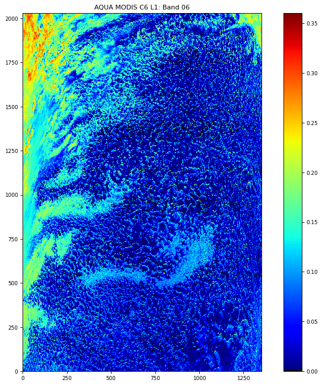

